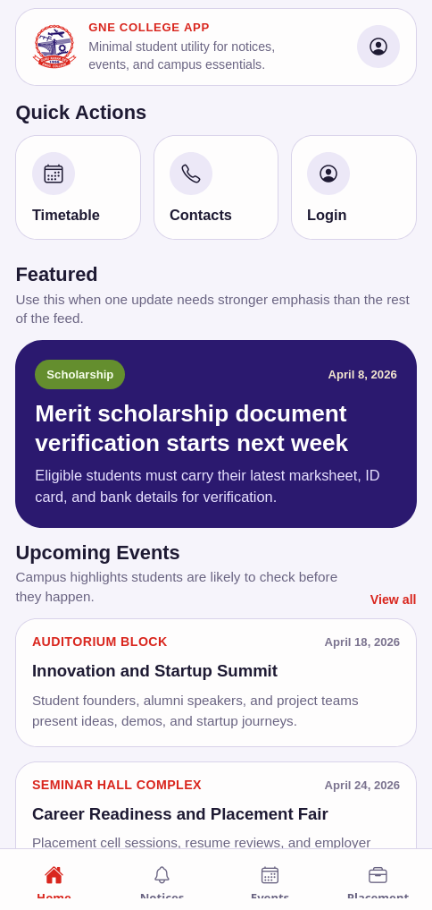
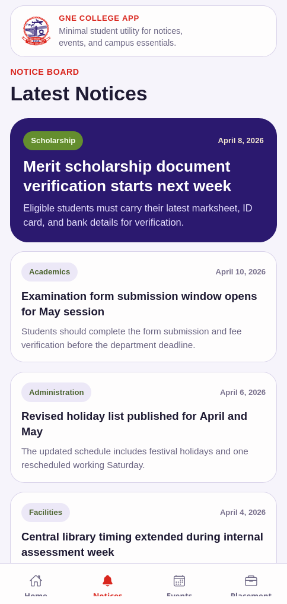
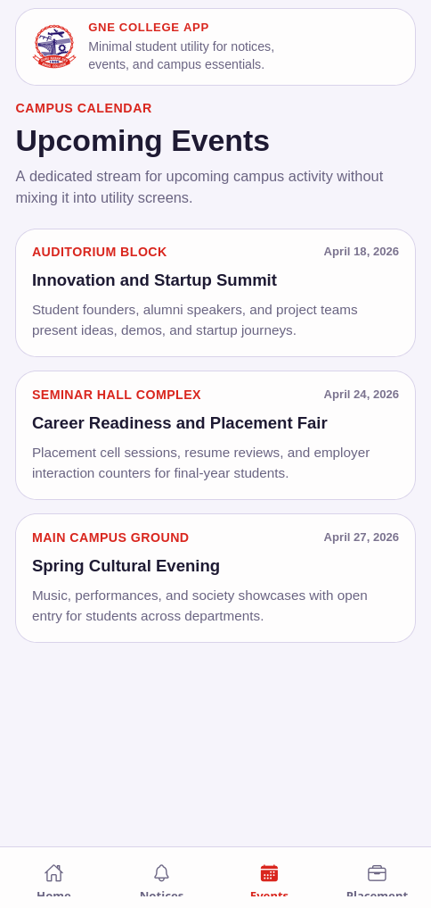
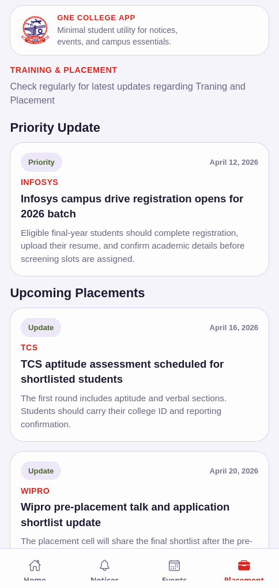

# GNDEC College App

A React Native mobile app concept for **Guru Nanak Dev Engineering College, Ludhiana**, built with **Expo**, **Expo Router**, and **NativeWind**.

This project is designed as a student-first campus app inspired by the official GNDEC website. Instead of copying the dense desktop layout, it narrows the mobile app down to the information students are most likely to check frequently.

## Current app focus

- Home dashboard
- Notice board
- Events tab
- Training & Placement tab
- Admin tab for local content publishing
- Timetable utility screen
- Contacts utility screen

## Design direction

The current information architecture is intentionally smaller than the website:

- high-frequency student updates stay in tabs
- lower-frequency tools stay in Home quick actions
- notices can be `featured` to stand out visually
- pinned notices surface a pin icon and sort to the top of the notices feed
- placement gets its own tab because deadlines and drive updates are high priority
- notice and event detail screens keep the bottom tab bar visible
- admin content management is local-only for prototype use

## Tech stack

- Expo SDK 54
- React Native 0.81
- React 19
- Expo Router
- NativeWind
- TypeScript

## Project structure

```text
app/
  _layout.tsx
  (tabs)/
    _layout.tsx
    index.tsx
    notices/
      index.tsx
      [id].tsx
    events/
      index.tsx
      [id].tsx
    placement.tsx
    admin/
      index.tsx
      notice.tsx
      notice/[id].tsx
      event.tsx
      event/[id].tsx
  contacts.tsx
  timetable.tsx
components/
  admin.tsx
  ui.tsx
constants/
  theme.ts
data/
  college-data.ts
lib/
  content-store.ts
```

## Screens

### Home

Student dashboard with:

- quick actions for timetable, contacts, and admin
- one featured notice highlight
- upcoming events preview



### Notices

Focused on:

- a complete notice feed
- `featured` notices with stronger visual emphasis
- pinned notices shown with a pin icon
- pinned notices sorted to the top
- notice detail view with bottom-tab navigation preserved



### Events

Includes:

- upcoming campus events
- date and venue shown together in the card header
- event detail view with bottom-tab navigation preserved



### Placement

Includes:

- placement updates and upcoming drives
- form submission links
- eligibility notes
- TPO contact details



### Admin

Includes:

- local admin login tab
- create notice and create event flows
- edit and delete for notices and events
- markdown-like editor with helper buttons
- live preview for heading, bullet, bold, and link formatting
- local persistence using AsyncStorage

Default demo login:

- username: `admin`
- password: `admin123`

### Utility screens

Includes:

- timetable selector
- campus and support contacts

## Local development

### Install dependencies

```bash
npm install
```

### Start the app

```bash
npm run start
```

You can also use:

```bash
npm run android
npm run ios
npm run web
```

## Tunnel note

If `expo start --tunnel` fails with an `ngrok` tunnel error, use LAN mode instead:

```bash
npx expo start --lan
```

This project has already shown tunnel startup issues locally, so LAN or emulator-based development is the more reliable option.

## Current limitations

- No backend or database yet
- Admin login is demo-only and stored locally on device
- Notice and event publishing is local-only and not shared across devices
- Placement, timetable, and contact content are still static demo data
- No image upload, file attachments, or remote sync

## Next improvements

- Replace mock data with real college content sources
- Replace local admin auth with a real backend-authenticated staff flow
- Move notices and events from local storage to a remote database/API
- Add richer editor controls and media support
- Add push notifications for urgent notices and placement updates
